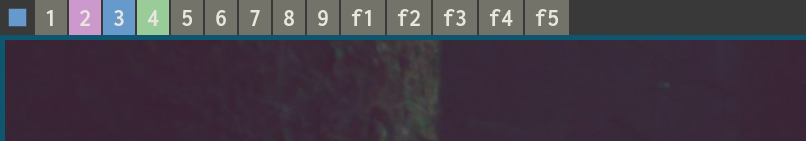
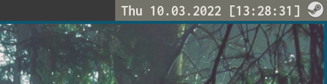

# ggbar

Status bar for Herbstluftwm that supports stalonetray.

```
ggbar x-offset y-offset width height monitor-num font stalone-offset stalone-enabled
```
E.g. `ggbar 0 0 1920 20 0 'Inconsolata Bold 12' 0 'true'`

Note that `stalone-offset` is measure from the *right* of the screen.

## Screenshots




- The blue rectangle to the left of the tags shows that the screen is focused. On unfocused screens, a white rectangle is visible.
- Blue: Tag visible on this screen
- Green: Tag visible on different screen
- Pink: Tag active, but not visible
- Gray: Tag inactive

## FAQ

- Why? Polybar doesn't really support HerbstluftWM. Also making this
was easier than figuring out how to configure Polybar.
- Why Rust? Good question! As it turns out, it's a bit pointless if you just
use bindings for XCB and Cairo.
- How to configure? Edit the source code (`src/config.rs`) or pass command line arguments.

